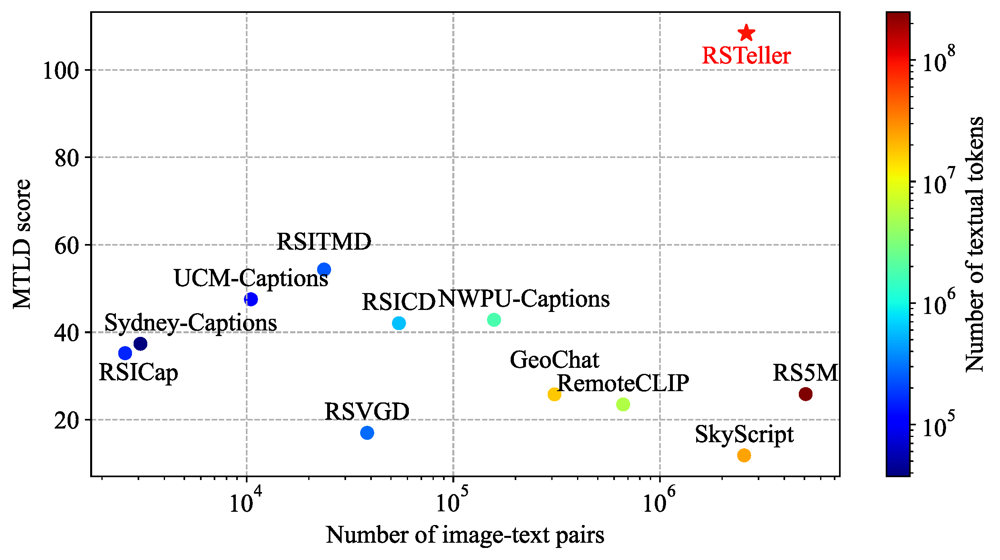

## Introduction

Vision-language models (VLMs) show great promise for interpreting remote sensing (RS) imagery in human-like ways. However, training effective VLMs requires massive amounts of paired image-text data - a significant challenge in the RS domain. 

Our solution? **RSTeller** - an automated workflow that generates high-quality RS image-text pairs at scale using:
- Openly available RS imagery from Google Earth Engine
- Semantic data from OpenStreetMap (OSM) 
- Large language models (LLMs) to generate rich captions

## Key Contributions

1. **Automated Workflow**: End-to-end pipeline for fetching RS data, generating captions with LLMs, and compiling datasets
2. **RSTeller Dataset**: 1.3M RS images with 2.6M high-quality captions (2x richer semantics than existing datasets)
3. **Comprehensive Experiments**: Validating dataset effectiveness, ablation studies, and scaling laws

## Methodology

### Data Generation Workflow



1. **Data Collection**:
   - RS images from NAIP via Google Earth Engine
   - Semantic tags from OpenStreetMap

2. **Caption Generation**:
   - Task 1: Describe "area" elements (land use, buildings)
   - Task 2: Describe "non-area" elements (roads, rivers)
   - Task 3: Caption augmentation for linguistic diversity

3. **Quality Control**:
   - Filter irrelevant OSM tags
   - Remove duplicate/hallucinated captions
   - Compile into WebDataset format

### Dataset Characteristics



- **Scale**: 1.3M images, 2.6M captions
- **Coverage**: Continental US, 0.6m GSD, RGB bands
- **Semantic Richness**: MTLD score >100 (2x higher than alternatives)
- **Diversity**: Covers 96K+ OSM keys and 155M+ tags

## Key Findings

### Dataset Effectiveness

Continual pre-training with RSTeller improves performance across RS tasks:

Zero-shot classification:


Zero-shot retrieval:


- Average accuracy improvements up to 4.89% (ViT-B/32) and 4.07% (ViT-L/14)
- Best results when starting from DataComp pre-trained checkpoints
- Minimal impact on general-domain performance (ImageNet)

### Ablation Study



Key takeaways:
1. Common knowledge (LAION-10M) prevents catastrophic forgetting
2. LLM interpretation boosts performance (vs template captions)
3. Caption augmentation (Task 3) provides consistent gains
4. Named entities have negligible impact

### Scaling Laws

Scaling laws tested on zero-shot classification:


Scaling laws tested on zero-shot retrieval:


- More domain data → Better performance (negative error slopes)
- ViT-L/14 outperforms ViT-B/32 consistently
- Some benchmarks show initial degradation before improvement

## Practical Recommendations

For researchers building RS VLMs:
1. Start with robust checkpoints (DataComp pre-trained)
2. Include common knowledge data to prevent forgetting
3. Use LLMs for caption generation (not just templates)
4. Scale domain data continuously - initial drops may recover
5. Larger models (ViT-L/14) generally perform better

## Limitations and Future Work

Current limitations:
- Single-element focus in captions
- Residual LLM hallucinations
- Limited geographic coverage (US only)
- Simple CLIP architecture

Future directions:
- Multi-element captioning
- Better hallucination suppression
- Global coverage expansion
- More sophisticated VLM architectures

## Conclusion

RSTeller provides:
✅ Automated pipeline for RS multimodal data
✅ High-quality dataset (1.3M images, 2.6M captions)
✅ Proven effectiveness for VLM training
✅ Clear path for future scaling

The dataset and code are publicly available to advance RS VLM research. For further details, please refer to the paper, it is publicly available at [arxiv.org/abs/2408.14744](https://arxiv.org/abs/2408.14744).
